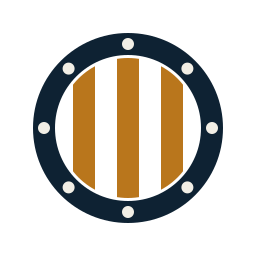

<p align="center">
  <picture>
    <source media="(prefers-color-scheme: dark)" srcset="assets/brig-mark-on-dark.svg">
    
  </picture>
</p>

# community-images

Guest images for the coding agents brig runs, with open Dockerfiles.

brig boots each agent from an OCI image rather than running it on your
machine. Those images have to come from somewhere, and baking them into the
runtime would make them opaque -- you would be trusting a binary blob with
your source tree and your provider keys. So they live here instead, one small
Dockerfile per agent, in a public repo, built and published by a workflow you
can read.

The point is that you can check what is in the sandbox before you put an agent
in it. Read the Dockerfile, verify the signature on what we published, or
ignore our images entirely and build your own. Any Linux CLI already works as
a bring-your-own image; see [docs/bring-your-own-image.md](docs/bring-your-own-image.md).

## The images

| Agent | CLI | Vendor | Image |
| --- | --- | --- | --- |
| Claude Code | `claude` | Anthropic | `ghcr.io/brig-sh/claude-code` |
| Codex | `codex` | OpenAI | `ghcr.io/brig-sh/codex` |
| Gemini CLI | `gemini` | Google | `ghcr.io/brig-sh/gemini` |
| Grok CLI | `grok` | xAI | `ghcr.io/brig-sh/grok` |
| opencode | `opencode` | OSS | `ghcr.io/brig-sh/opencode` |
| Cursor Agent | `cursor-agent` | Cursor | not published, see below |

Claude Code and Codex are the proven core. Gemini, Grok and opencode are
example templates -- they build, and the CLI runs, but they have had less
mileage than the first two.

Image names match the agent template names, so a template row and an image
reference stay the same string.

Every image is credential-free by design. No key, no token and no session is
baked into any of them. The agent authenticates at runtime and its state lands
in the home directory, which is what brig persists for you.

### Two variants of each

Each agent is published twice, from the same Dockerfile:

| | Image | What it is |
| --- | --- | --- |
| bootable | `ghcr.io/brig-sh/<agent>` | a microVM guest: guest kernel, `urunit`, urunc metadata. What brig boots. |
| stock | `ghcr.io/brig-sh/<agent>-stock` | an ordinary container image: the same rootfs, none of the microVM machinery. |

The stock variant is for the cases where a microVM is not what you want --
running the agent under docker or podman, in a Kubernetes pod, in CI, or as a
base to build your own guest image on. It is about 8MB smaller on the wire
(`codex` 269MB against `codex-stock` 261MB): the guest kernel and the two init
binaries, and not much else. The rootfs is the same, so most of the size is
Ubuntu and the agent either way.

They are not two Dockerfiles. The `#syntax` line is stripped and the same file
is built plainly, in the same CI job, on the same runner, against the same
resolution of `ubuntu:24.04`. Two files, or even two jobs, could drift; this
cannot. And `make check-stock` asserts the absence of `/.boot/kernel`,
`/urunc.json` and `/urunit` rather than assuming it, because an image that
quietly kept a 50MB kernel would still run fine under docker and nobody would
notice.

```bash
docker run --rm -it ghcr.io/brig-sh/codex-stock codex --version
```

### Cursor

`images/cursor/` builds and is exercised on every pull request, but we do not
publish it. Publishing would mean hosting a redistribution of Cursor's binary
from our registry, and that is a question their terms have to answer first.
That check is still open, so the image stays unpublished rather than published
and quietly hoped about.

Nothing stops you building it yourself today. `make -C images/cursor build`
fetches the CLI straight from Cursor and never touches our registry.

## Pulling and verifying

```bash
docker pull ghcr.io/brig-sh/claude-code
```

Everything we publish is signed with keyless cosign. There is no key to
distribute and no key for us to lose: the signature is bound to the workflow
that produced the image, and it is recorded in Sigstore's public transparency
log. To check a signature is really ours:

```bash
cosign verify \
  --certificate-identity-regexp \
    '^https://github.com/brig-sh/community-images/.github/workflows/build-images.yml@refs/' \
  --certificate-oidc-issuer https://token.actions.githubusercontent.com \
  ghcr.io/brig-sh/claude-code
```

That command is the interesting one. It does not ask "was this signed?" -- it
asks "was this built by that workflow, in that repo?". A signature from
anywhere else fails it.

Each image also carries an SPDX SBOM as a signed attestation, so you can see
the packages inside before you boot it:

```bash
cosign verify-attestation --type spdxjson \
  --certificate-identity-regexp \
    '^https://github.com/brig-sh/community-images/.github/workflows/build-images.yml@refs/' \
  --certificate-oidc-issuer https://token.actions.githubusercontent.com \
  ghcr.io/brig-sh/claude-code \
  | jq -r '.payload | @base64d | fromjson | .predicate.name'
```

## Architectures

Every image is published for both arm64 and amd64: arm64 for brig on Apple
Silicon, amd64 for urunc on Linux.

| Tag | What it is |
| --- | --- |
| `:latest` | multi-arch index, resolves to the right one |
| `:arm64`, `:amd64` | the per-arch images |
| `:arm64-<short-sha>`, `:amd64-<short-sha>` | immutable, for pinning a build |

Prefer `:latest` or a digest. Pulling the wrong architecture here is worse
than usual: each one bundles a different guest kernel, so it does not merely
run slowly under emulation, it does not boot at all.

The difference is the setup each one boots in. arm64 runs under Apple
Virtualization.framework with a virtiofs root; amd64 runs under urunc on Linux
with an ext4 block root. Both currently boot on the kernel bunny bundles.

## Guest kernels

A guest kernel is its own artifact, on its own cadence. An image rebuilds
whenever an agent CLI moves, which is often; a kernel changes when the setup it
boots in changes, which is rare. So `Build kernel` builds them separately and
publishes them under `ghcr.io/brig-sh/kernel`, one tag per profile:

| Profile | Setup | Root |
| --- | --- | --- |
| `arm64` | brig on Apple Silicon, Virtualization.framework | virtiofs |
| `amd64` | urunc on Linux | ext4 block (devmapper snapshot) |

Each publishes the bootable image, the exact `config` it was built with, and a
`config.diff` against `defconfig`, so you can read what is in the kernel your
agent runs on:

```bash
oras pull ghcr.io/brig-sh/kernel:amd64 -o ./k
grep -E 'VIRTIO_BLK|EXT4_FS|OVERLAY_FS' ./k/config
```

Every driver the guest needs to reach its root is compiled in. It boots with no
initramfs, so such a driver cannot be a module -- it would live on the
filesystem it is required to mount. Everything else stays modular and is never
shipped, since the guest carries no `/lib/modules`.

`kernel/build-kernel.sh` hard-gates each required symbol to `=y`, plus the boot
magic, that BTF was generated, and a size cap. Those gates earn their keep:
`scripts/config --enable` is a request, not a guarantee, and the size cap
already caught a config that built the whole defconfig driver set into a
headless guest.

Wiring the images to boot these instead of bunny's default is the next step,
and deliberately separate: the arm64-on-bunny-default configuration is the only
one that has actually been booted.

## Building locally

You need Docker and nothing else. The guest binaries are compiled inside
containers, so there is no host toolchain to install -- this runs on an Apple
Silicon Mac as-is.

```bash
make -C images/claude-code build check
```

`build` produces `ghcr.io/brig-sh/claude-code:arm64` locally. `check` then
asserts the result is actually bootable and that the agent runs as the image's
unprivileged user. Useful knobs, all overridable on the command line:

| Variable | Default | What it does |
| --- | --- | --- |
| `IMAGE` | `ghcr.io/brig-sh/<agent>:<arch>` | Tag to build |
| `PLATFORM` | `linux/arm64` | Build platform (`linux/amd64` also builds the guest kernel) |
| `AGENT_UID` | `501` | uid of the in-guest user |
| `URUNC_SRC` / `URUNIT_SRC` | cloned into `dist/src` | Guest init checkouts |

`AGENT_UID` defaults to 501 because that is the first human user on macOS.
Files the agent writes to a shared directory then carry your ownership and
stay writable from both sides. On a Linux host, set it to your own uid.

## How an image is put together

Two stages, and the split matters.

The `Dockerfile` is a [bunny](https://github.com/nubificus/bunny) build. The
`#syntax` line at the top swaps in bunny as the BuildKit frontend, which
packages the result as a bootable microVM image rather than a plain container:
a guest kernel under `/.boot`, the urunc metadata in `/urunc.json`, and the
rootfs. Delete that one line and you get an ordinary OCI image, which is a
perfectly good thing to have.

`Dockerfile.overlay` is then a plain `docker build` on top, copying in the
guest init (`urunit`) and the exec agent (`urunit-agent`). It is separate on
purpose: bunny injects its own stock `urunit`, and the agent-capable one has
to override it. Both are compiled from source at build time, from public
repos, so an image always ships the current init rather than whatever was
vendored months ago.

`images/agent.mk` holds the actual build rules. A per-agent `Makefile` is four
lines of data on top of it.

## What is not here yet

Worth being explicit about, since these are the questions people ask.

**No boot test in CI, on either architecture.** `make check` proves an image
has a kernel, its urunc metadata, both guest binaries and a runnable CLI. It
does not prove the thing boots. arm64 would need Apple Virtualization.framework
and therefore an Apple Silicon runner; amd64 would need a Linux runner with
urunc and devmapper set up. Treat the published images as build-verified, not
boot-verified.

**Reproducibility is version-pinned, not bit-for-bit.** Every agent CLI is
pinned to an exact version in its Dockerfile, so a rebuild installs the same
agent. The Ubuntu package set underneath still moves.

## Adding an agent

Copy the closest existing directory and change the install stanza. That is the
whole design -- the Dockerfiles are small and repetitive on purpose, so adding
an agent is a copy and an edit rather than an exercise in build-system
archaeology. See [CONTRIBUTING.md](CONTRIBUTING.md).

## License

Apache-2.0, see [LICENSE](LICENSE). That covers the Dockerfiles and the build
tooling in this repo. The agent CLIs the images install are each under their
own vendor's terms.
